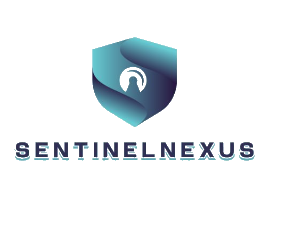

<div align="center">

  

  <h1 align="center">SentinelNexus</h1>
  <p align="center">
    <strong>Enterprise-Grade AI Security & Risk Intelligence Platform</strong>
  </p>

  <p align="center">
    <a href="https://mayankiitj.in"></a>
    <a href="https://mayyanks.app"></a>
    <a href="https://github.com/Mayank-iitj/final-sentinelnexus-clerkOauth/blob/main/LICENSE"></a>
    
    
  </p>

  <p align="center">
    <br />
    <a href="#-features">Features</a> · 
    <a href="#-tech-stack">Tech Stack</a> · 
    <a href="#-quick-start">Quick Start</a> · 
    <a href="#-architecture">Architecture</a> · 
    <a href="#-security">Security</a>
  </p>
</div>

<br />

> **SentinelNexus** is the world's first comprehensive AI security and compliance platform for enterprise LLM workflows. Protect your AI applications from prompt injections, data exfiltration, and compliance drifts with real-time defense and universal trust scoring.

---

## ✨ Features

Our platform delivers production-ready risk intelligence and monitoring for modern AI systems.

- 🛡️ **Pure ASGI Security Middleware**: 6-layer production interception engine capable of detecting SQLi, Command Injection, Prompt Injections, Path Traversals, SSRF, XXE, and SSTI with zero-latency overhead. Includes a semantic RAG scorer.
- 📡 **Live Security Telemetry**: Real-time Redis-backed dashboard surfacing block events, attack vectors, and Layer-0 automated bans natively within the platform.
- 🔍 **Code Security Scanning**: 120+ SAST rules for secrets, injections, and IaC misconfigurations with CVSS v3.1 scoring.
- ⚙️ **Real-Time Digital Twin**: Interactive live attack graphs and zero-day threat prediction for your entire AI infrastructure.
- ⚔️ **Autonomous Red/Blue Agents**: Continuous automated attack simulation and infrastructure-as-code patch generation.
- ⚖️ **Global Regulation Engine**: One-click multi-framework compliance automation with automated evidence collection.
- 📊 **Universal AI Trust Score™**: Real-time, dynamic risk quantification engine combining vulnerabilities, supply chain risk, and brand trust.
- 🎨 **Enterprise-Grade UI**: 18+ fully designed, responsive, dark-mode modules (including Cyber Insurance, XAI Explainability, and Executive Boardroom) leveraging Tailwind CSS and Framer Motion.

---

## 🛠 Tech Stack

SentinelNexus is built on a high-performance, hyper-scalable modern architecture.

### Frontend


- **Framework**: Next.js 15 (App Router)
- **Styling**: Tailwind CSS + Vanilla CSS Modules
- **Animations**: Framer Motion, GSAP, Three.js, PostProcessing
- **Authentication**: Clerk OAuth

### Backend


- **Framework**: FastAPI (Python 3.11+)
- **Database**: PostgreSQL (SQLAlchemy ORM)
- **Caching**: Redis
- **Containerization**: Docker & Docker Compose

---

## 🚀 Quick Start

Get SentinelNexus running locally in minutes using Docker.

### 1. Environment Setup

Clone the repository and set up your environment variables.

```bash
git clone https://github.com/Mayank-iitj/final-sentinelnexus-clerkOauth.git
cd final-sentinelnexus-clerkOauth
```

Create a `.env` file in the `backend/` directory:
```env
DATABASE_URL=sqlite:///./dev.db
REDIS_URL=redis://localhost:6379/0
SECRET_KEY=your-dev-secret-key
JWT_SECRET_KEY=your-jwt-key
GOOGLE_CLIENT_ID=your-google-client-id
GOOGLE_CLIENT_SECRET=your-google-client-secret
```

Create a `.env.local` file in the `frontend/` directory:
```env
NEXT_PUBLIC_API_URL=http://localhost:8000/api/v1
BACKEND_URL=http://localhost:8000
NEXT_PUBLIC_CLERK_PUBLISHABLE_KEY=your-clerk-publishable-key
CLERK_SECRET_KEY=your-clerk-secret-key
NEXT_PUBLIC_SITE_URL=http://localhost:3000
```

### 2. Start the Stack

The fastest way to spin up the entire application is using Docker Compose.

```bash
docker compose up --build
```

### 3. Access the Application

- **Web Dashboard**: [http://localhost:3000](http://localhost:3000)
- **API Server**: [http://localhost:8000](http://localhost:8000)
- **Interactive API Docs (Swagger)**: [http://localhost:8000/docs](http://localhost:8000/docs)

*(For manual setup without Docker, refer to the [Development Guide](./DEVELOPMENT.md))*

---

## 🏗 Architecture

SentinelNexus relies on a strict separation of concerns, dividing responsibilities cleanly between the interactive presentation layer and the rigorous backend logic processing.

```text
sentinelnexus/
├── backend/                     # API Server (FastAPI)
│   ├── app/
│   │   ├── api/v1/              # API endpoints
│   │   ├── core/                # Configuration & Security parameters
│   │   ├── db/                  # Database connections
│   │   ├── models/              # SQLAlchemy ORM definitions
│   │   ├── schemas/             # Pydantic validation schemas
│   │   └── services/            # Core business & scanning logic
│   ├── tests/                   # Pytest suite
│   └── requirements.txt         
├── frontend/                    # Web Application (Next.js)
│   ├── src/
│   │   ├── app/                 # App Router pages & API routes
│   │   ├── components/          # Reusable UI components & animations
│   │   └── lib/                 # Utility functions & contexts
│   ├── public/                  # Static assets
│   └── package.json             
└── docker/                      # Containerization configs
```

---

## 🛡 Security & Compliance

Security isn't just our product—it's woven into our architecture.

| Feature | Description | Implementation |
|---------|-------------|----------------|
| **OAuth 2.0 Auth** | Seamless, secure sign-in flows | Clerk |
| **API Security** | Secure endpoint validation | JWT Tokens |
| **Traffic Control** | DDoS & spam prevention | Redis Rate Limiting (100 req/min) |
| **Data Safety** | SQL Injection immunity | SQLAlchemy ORM |
| **Web Protection** | XSS & Cross-origin validation | Security Headers + CORS |
| **Audit Trails** | Complete chronological logging | Request Tracking Middleware |

---

## 📈 Performance Benchmarks

Built for speed and scale. Tested continuously under load.

- **Frontend Core Web Vitals**: `< 2s` LCP
- **Lighthouse Score**: `95+` (Performance & SEO)
- **API Response Time**: `< 500ms` at p99
- **Database Query Average**: `< 50ms`

---

## 📚 Extensive Documentation

Explore our comprehensive guides for deploying, scaling, and contributing to SentinelNexus.

- 📖 [Platform Overview](./PLATFORM_OVERVIEW.md)
- 🚀 [Complete Deployment Guide](./COMPLETE_DEPLOYMENT_GUIDE.md)
- 🔐 [OAuth Setup Instructions](./OAUTH_SETUP.md)
- 🧪 [Production Readiness Report](./PRODUCTION_READINESS_REPORT.md)
- 💻 [Development Guide](./DEVELOPMENT.md)

---

<div align="center">
  <p>Engineered with 💜 by <a href="https://mayankiitj.in">Mayank Sharma</a></p>
  <p>
    <a href="https://twitter.com/mayankiitj">Twitter</a> •
    <a href="https://github.com/Mayank-iitj">GitHub</a> •
    <a href="https://linkedin.com">LinkedIn</a>
  </p>
</div>
